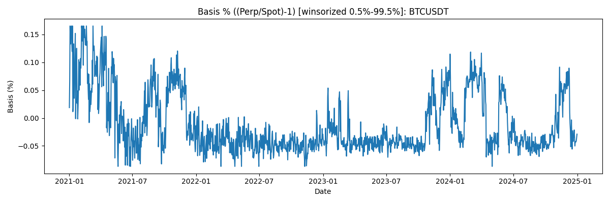
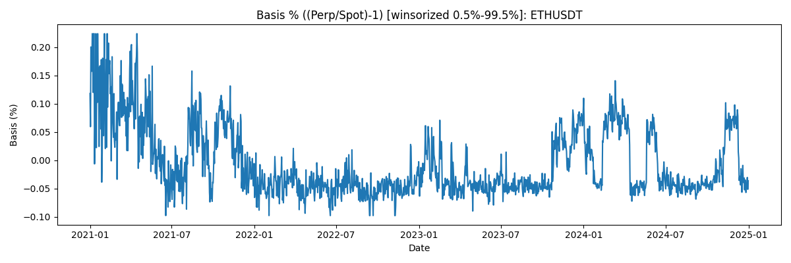

# Quant Technical Assessment Report

## Data
- **Source:** Binance REST APIs (spot/perpetual klines, funding rates)
- **Period:** 2021-01-01 to 2024-12-31
- **Symbols:** BTCUSDT, ETHUSDT
- **Frequency:** 1d
- **Execution convention:** signal computed on **t close**, executed at **t+1 open**, PnL measured **open→open**.

## Part 1a: Basis Analysis (Perp − Spot)

### Basis definitions
- **Absolute basis (USDT):** `basis_abs = perp_price − spot_price`
- **Percentage basis:** `basis_pct = perp_price/spot_price − 1`
  - `basis_pct` is usually more comparable across price regimes (BTC at 20k vs 60k), so it is preferred for cross-time comparison.
- In this report, the **basis plots/stats come from `scripts/01_basis_analysis.py`** (currently using **close** prices for descriptive analysis),
  while the **backtests execute at next-day open** to respect the signal/execution timing.

### Basis time series plots (absolute, winsorized)
- 
- 

### Basis time series plots (percentage, winsorized)
- 
- 

### Statistical summary

| symbol   |   count |   basis_pct_mean |   basis_pct_std |   basis_pct_min |   basis_pct_p05 |   basis_pct_p50 |   basis_pct_p95 |   basis_pct_max |   basis_ann_mean |
|:---------|--------:|-----------------:|----------------:|----------------:|----------------:|----------------:|----------------:|----------------:|-----------------:|
| BTCUSDT  |    1461 |     -0.000103154 |     0.000541269 |     -0.00111852 |    -0.000639816 |    -0.000334396 |     0.000939179 |      0.00191781 |       -0.0376514 |
| ETHUSDT  |    1461 |     -6.11341e-05 |     0.000625205 |     -0.00183107 |    -0.000672908 |    -0.000332358 |     0.00106031  |      0.00360761 |       -0.022314  |

## Part 1b/1c: Funding Rate Arbitrage Strategies

### Strategy requirements (from prompt)
- **Delta-neutral per asset:** long spot + short perpetual with **equal USDT notional**.
- **One position per asset:** ON/OFF per symbol (no multiple concurrent pairs on the same asset).
- **Market-neutral portfolio:** exposure is only via delta-neutral pairs.

### Baseline (1b)
- **Rule:** always maintain the delta-neutral pair for each asset (continuous carry collection).
- **Rebalancing:** daily to keep spot notional ≈ perp notional.
- **Primary return driver:** funding payments.

### Enhanced (1c)
- **Rule:** dynamically enter/exit based on carry regime (funding) and basis risk regime.
- **Goal:** avoid negative carry / extreme basis blowout regimes while still capturing most positive funding days.
- **Optional concentration:** Top-K selection (often K=1) to allocate capital to the best carry candidate, with anti-churn controls.

### Equity curves
- 
- 
- 

### Return attribution (best-effort; summed daily components recorded by engine)

| strategy   | pnl_funding   | pnl_spot   | pnl_perp   |   pnl_fees | pnl_total_sum   |   avg_n_active |   active_days |
|:-----------|:--------------|:-----------|:-----------|-----------:|:----------------|---------------:|--------------:|
| baseline   | 547,297       | 1,601,964  | -1,601,174 |          0 | 548,088         |              2 |          1459 |
| enhanced   | 581,454       | 1,998,591  | -1,998,952 |          0 | 581,092         |              1 |          1459 |

**Quick comparison:**
- Final equity: baseline=1,569,375 vs enhanced=1,572,021 (initial=1,000,000).
- Funding PnL sum: baseline=547,297 vs enhanced=581,454.
- Avg active positions (n_active): baseline=2.00 vs enhanced=1.00.

## Part 2: Support/Resistance Price Action Strategy

### Price + Support/Resistance overlay
- 
- 

### Equity curve
- 

## Performance Summary (includes Alpha vs benchmark)

| strategy        | annualized_return   |   sharpe | max_drawdown   | alpha   | buy_hold_cagr |
|:----------------|:--------------------|---------:|:---------------|:--------|:--------------|
| arb_baseline    | 11.93%              |   5.568  | -0.25%         | -28.51% | 40.44%        |
| arb_enhanced    | 11.98%              |   7.732  | -0.32%         | -28.46% | 40.44%        |
| sr_price_action | 16.90%              |   0.9039 | -20.62%        | 16.90%  | 40.44%        |

### Metric definitions
- **Annualized return:** CAGR of the strategy equity curve.
- **Sharpe:** mean(daily returns) / std(daily returns) * sqrt(365) (implementation-dependent, see `src/metrics.py`).
- **Max drawdown:** worst peak-to-trough decline of equity.
- **Buy & hold CAGR:** CAGR of the benchmark series used in performance calculation.
- **Alpha (in this project):** `CAGR(strategy) − CAGR(benchmark)` (see `alpha_mode='cagr_diff'`).

## Part 3: Discussion

### Strategy execution details
- **Signal timing:** computed using information available at **t close**.
- **Execution timing:** trades are executed at **t+1 open**, with **slippage** and **fees** applied.
- **PnL accounting:** computed **open→open** to match execution convention.
- **Market-neutral constraint:** each held symbol is long spot + short perp with equal USDT notional.
- **One position per asset:** enforced by ON/OFF holding signal per symbol.

### What drives performance in funding arbitrage
- Baseline return is mainly **funding income**, with residual noise from basis/price movements due to discrete rebalancing.
- Enhanced can outperform only if it **avoids enough negative carry / extreme basis regimes** without losing too many positive carry days.
- A key practical trade-off is **turnover vs carry capture**: too much switching increases costs and reduces net carry.

### Why enhanced may underperform baseline (typical failure modes)
- **Over-filtering / low time-in-market:** strict entry conditions reduce funding collection days.
- **Churn / switching costs:** frequent enter/exit or Top-K switching can make fees dominate thin carry.
- **Regime mismatch:** basis blowouts can persist; exiting too early or re-entering too late hurts compounding.

### Data & engineering challenges
- **API pagination / rate-limits:** handled via iterative REST pagination and local CSV caching.
- **Alignment:** spot/perp/funding are aligned on a common daily index; missing values handled via reindex + ffill where appropriate.
- **Reproducibility:** all intermediate datasets are saved to `data/`, and all backtest outputs to `output/`.

### Limitations / simplifying assumptions
- **Funding aggregation:** approximated as `funding_rate_daily * perp_notional`.
- **Fees/slippage:** constant parameters; real markets vary by liquidity, order type, and venue.
- **Margin & liquidation:** simplified (maintenance checks only); real exchange liquidation uses mark price and more complex rules.
- **Borrow costs on spot:** not modeled.

### Improvements / robustness checks
- **Walk-forward / rolling validation:** tune enhanced thresholds on rolling windows rather than a single full-period fit.
- **Transaction cost sensitivity:** re-run with higher fees/slippage to test if alpha survives.
- **Universe expansion:** more symbols can diversify carry and reduce concentration risk.
- **Better basis risk control:** incorporate widening speed (slope/acceleration) and volatility scaling.
- **Portfolio risk guardrails:** add portfolio-level risk-off rules during extreme regimes.

## Reproducibility

Typical run sequence:

```bash
python main.py
python scripts/01_basis_analysis.py
python scripts/05_generate_report.py
```

Key outputs (under `output/`):
- `*_equity.csv`, `*_trades.csv`, `*_perf.json`
- `basis_abs_*.png`, `basis_pct_*.png`, `equity_*.png`, `sr_overlay_*.png`
- `report.md`

