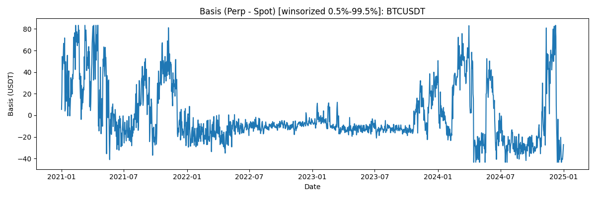
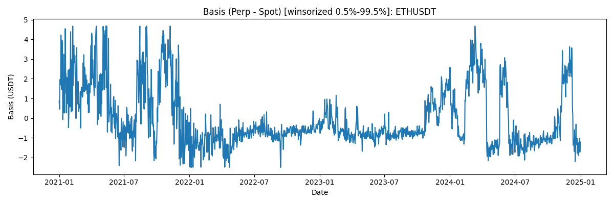
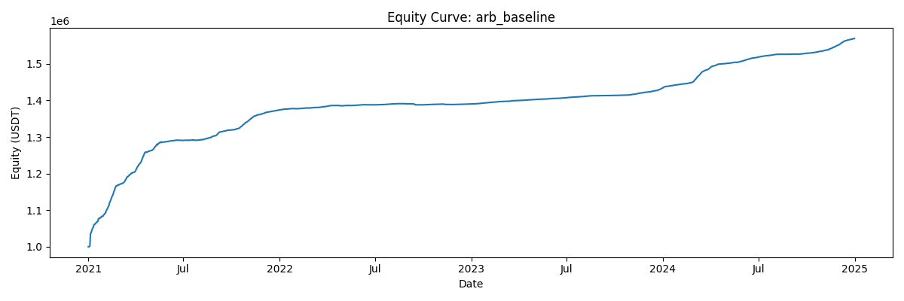
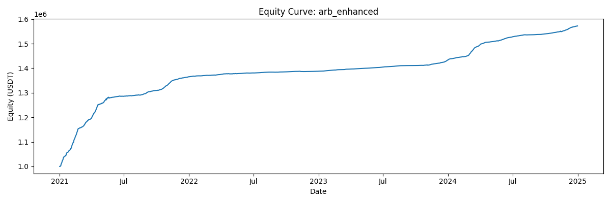
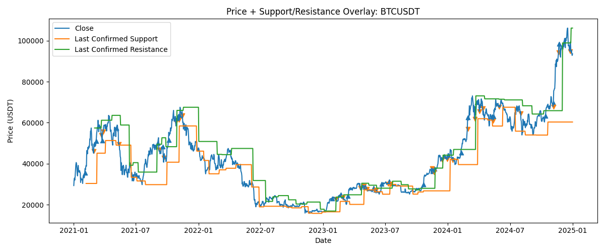
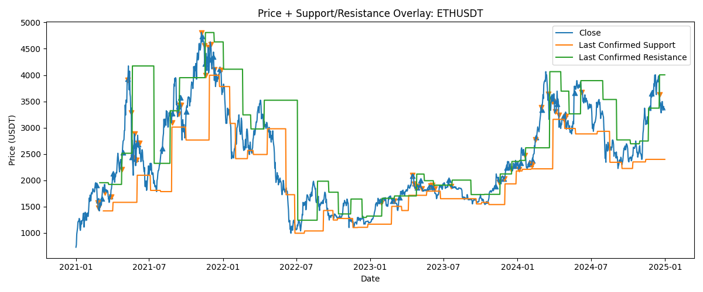
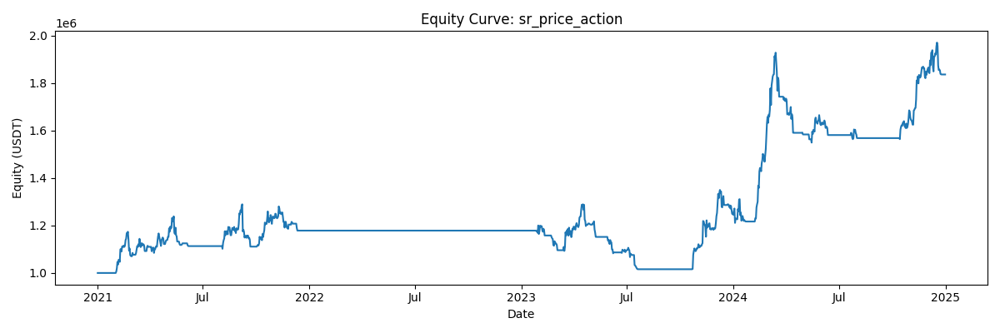

# Quant Technical Assessment Report

## Data
- **Source:** Binance REST APIs (spot/perpetual klines, funding rates)
- **Period:** 2021-01-01 to 2024-12-31
- **Symbols:** BTCUSDT, ETHUSDT
- **Frequency:** 1d (signal computed on *t close*, executed on *t+1 open*, PnL measured open→open)

## Part 1a: Basis Analysis (Perp − Spot)

### Definition
- **Basis (open-consistent):** `basis_t = perp_open_t − spot_open_t`
- Interpretation: positive basis implies perpetual trading at a premium to spot; extreme values may indicate risk regimes.

### Basis time series plots
- 
- 

### Statistical summary

| symbol   |   count |   basis_pct_mean |   basis_pct_std |   basis_pct_min |   basis_pct_p05 |   basis_pct_p50 |   basis_pct_p95 |   basis_pct_max |   basis_ann_mean |
|:---------|--------:|-----------------:|----------------:|----------------:|----------------:|----------------:|----------------:|----------------:|-----------------:|
| BTCUSDT  |    1461 |     -0.000103154 |     0.000541269 |     -0.00111852 |    -0.000639816 |    -0.000334396 |     0.000939179 |      0.00191781 |       -0.0376514 |
| ETHUSDT  |    1461 |     -6.11341e-05 |     0.000625205 |     -0.00183107 |    -0.000672908 |    -0.000332358 |     0.00106031  |      0.00360761 |       -0.022314  |

## Part 1b/1c: Funding Rate Arbitrage Strategies

### Strategy requirements (from prompt)
- **Delta-neutral:** long spot + short perpetual of **equal USDT notional** per held asset.
- **One position per asset:** ON/OFF per symbol (no multiple concurrent pairs on the same asset).
- **Market-neutral portfolio:** no net directional exposure (only delta-neutral pairs).

### Baseline (1b)
- **Rule:** always maintain the delta-neutral pair for each asset (continuous carry collection).
- **Rebalancing:** daily to keep spot notional ≈ perp notional.
- **Primary return driver:** funding payments.

### Enhanced (1c)
- **Rule:** dynamically enter/exit the delta-neutral pair based on *carry regime* (funding) and *basis risk regimes*.
- **Intuition:** remain in the trade to collect funding when carry is favorable, but reduce exposure during unfavorable carry or extreme basis regimes.
- **Optional concentration:** Top-K selection (K=1 by default) to allocate capital to the asset with better carry signal, with anti-churn controls to limit switching.

### Equity curves
- 
- 

### Return attribution (best-effort, using engine PnL components)

| strategy   | pnl_funding   | pnl_spot   | pnl_perp   | pnl_total_sum   |   avg_n_active |   active_days |
|:-----------|:--------------|:-----------|:-----------|:----------------|---------------:|--------------:|
| baseline   | 547,297       | 1,601,964  | -1,601,174 | 548,088         |              2 |          1459 |
| enhanced   | 581,454       | 1,998,591  | -1,998,952 | 581,092         |              1 |          1459 |

**Quick comparison:**
- Final equity: baseline=1,569,375 vs enhanced=1,572,021 (initial=1,000,000).
- Funding PnL sum: baseline=547,297 vs enhanced=581,454.
- Avg active positions (n_active): baseline=2.00 vs enhanced=1.00.

## Part 2: Support/Resistance Price Action Strategy

### Price + Support/Resistance overlay
- 
- 

### Equity curve
- 

## Performance Summary (includes Alpha vs buy&hold)

| strategy        | annualized_return   |   sharpe | max_drawdown   | alpha   | buy_hold_cagr   |
|:----------------|:--------------------|---------:|:---------------|:--------|:----------------|
| arb_baseline    | 11.93%              |   5.568  | -0.25%         | -28.51% | 40.44%          |
| arb_enhanced    | 11.98%              |   7.732  | -0.32%         | -28.46% | 40.44%          |
| sr_price_action | 16.90%              |   0.9039 | -20.62%        | -23.54% | 40.44%          |

## Part 3: Discussion

### Strategy execution details
- **Signal timing:** signals are computed using information available at **t close**.
- **Execution timing:** orders are executed at **t+1 open** with **slippage** and **fees** applied.
- **PnL accounting:** daily PnL is computed **open→open** to remain consistent with the execution price.
- **Market-neutral constraint:** when a symbol is ON, the portfolio holds **long spot + short perp** with equal USDT notional.
- **Position constraint:** each symbol is ON/OFF (at most one arbitrage pair per asset).

### What drives performance for funding arbitrage
- **Funding income is the dominant driver** in baseline; price drift and basis changes can add noise but should not dominate over long horizons.
- Enhanced strategies can outperform only if they either:
  1) avoid sufficiently many **negative-carry days**, and/or
  2) avoid **basis blowout risk** periods that cause drawdowns,
  while not sacrificing too many positive funding days.

### Why enhanced may underperform baseline (and how we mitigated it)
- **Turnover cost (fees+slippage)**: dynamic rules can increase trading frequency and switching, which quickly eats thin carry.
- **Over-filtering**: strict entry conditions reduce time-in-market, directly reducing funding income.
- **Parameter semantics mismatch**: basis thresholds must match the implemented condition (e.g., `enter if z <= entry_z_max`).
- **Mitigation direction used here**: higher switching thresholds, longer minimum hold, stricter exit confirmation, and less restrictive entry gates.

### Challenges & solutions
- **API pagination / rate-limits:** handled via iterative REST pagination and local CSV caching.
- **Data completeness:** aligned spot/perp/funding on a common daily index and used forward-filling where appropriate.
- **Execution consistency:** used open-consistent basis definition and open→open PnL.
- **Risk modeling simplifications:** margin and liquidation are simplified; the goal is consistent relative comparison of strategies.

### Limitations (important assumptions)
- **Funding aggregation:** funding is treated as `funding_rate_daily * perp_notional` (daily approximation).
- **Fees/slippage:** constant rates are assumed; in reality they depend on venue, liquidity, and order type.
- **Margin & liquidation:** simplified maintenance margin checks; real exchanges have more complex mark price/liquidation rules.
- **Borrow/financing for spot:** spot long implicitly assumes capital is available; no borrow cost is included.

### Suggested improvements / robustness checks
- **Robustness grid / walk-forward:** evaluate enhanced parameters (lookback, exit thresholds, switch bands) on rolling windows.
- **Transaction cost sensitivity:** re-run with higher fees/slippage to test if alpha survives realistic costs.
- **Multiple assets / universe expansion:** include more symbols to diversify carry and reduce concentration risk.
- **Better basis risk control:** add widening-speed filters (slope/acceleration) and volatility scaling.
- **Risk budget:** cap exposure per asset and add portfolio-level stop/risk-off logic for extreme regimes.

